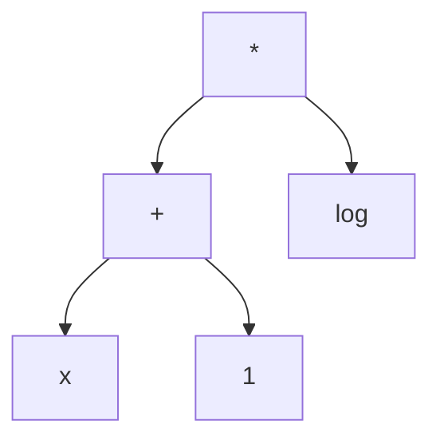

# How the program works
## Tokenizer
The expression is first converted into a token list.  
Valid tokens include numbers, operators, parenthesis, and function names.  
For example: `"12*sin(x)"` becomes `["12", "*", "sin", "(", "x", ")"]`

The program starts with an empty string and repeatedly adds characters until the string is a valid token.  
Then, the program repeatedly adds characters until the token is no longer valid. This way, if `sinh` were a token, it wouldn't be mistaken as a `sin`.  

For a more robust algorithm, a trie can be utilized but is unncessary for the small number of possible tokens that we consider.

## Syntax Tree
Next, each `"("` token is matched to its corresponding `")"` token via a stack algorithm and stored in a `std::map`.

Then, the tree is constructed recursively.  
The algorithm itself is a modified version of the "Shunting Yard Algorithm" (which is also just an application of monotonic stacks!).  
The recursive aspect arises from needing to process expressions nested inside parenthesis. 

For example: `"(x+1)*log(x)"` becomes

## Differentiate

## Simplifying
