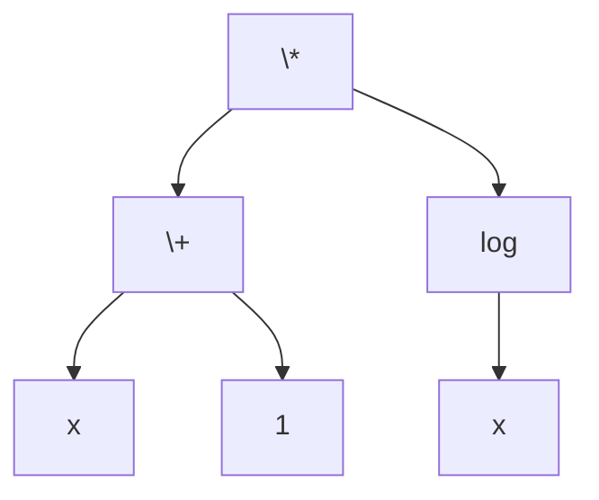

# How the program works
## Tokenizer
The expression is first converted into a token list.  
Valid tokens include numbers, operators, parenthesis, and function names.  
For example: `"12*sin(x)"` becomes `["12", "*", "sin", "(", "x", ")"]`

The program starts with an empty string and repeatedly adds characters until the string is a valid token.  
Then, the program repeatedly adds characters until the token is no longer valid. This way, if `sinh` were a token, it wouldn't be mistaken as a `sin`.  

For a more robust algorithm, a trie can be utilized but is unncessary for the small number of possible tokens that we consider.

## Syntax Tree
Next, each `"("` token is matched to its corresponding `")"` token via a stack algorithm and stored in a `std::map`.

Then, the tree is constructed recursively.  
The algorithm itself is a modified version of the "Shunting Yard Algorithm" (which is also just an application of monotonic stacks!).  
The recursive aspect arises from needing to process expressions nested inside parenthesis. 

Getting into the specifics, each node is represented by a `node` class. There are also different subclass types such as `variable_node` and `op_node` that correspond to what the node represents. 

For example: `"(x+1)*log(x)"` becomes

## Differentiate
Each node type inherits and implements a `deriv()` function.  
For example, `number_node::deriv()` returns a `"0"` node. `op_node::deriv()` implements the operator rules for differentiation such as product rule or power rule.  
`func_node::deriv()` implements the chain rule and matches functions to their derivatives such as `"sin"` becoming `"cos"`. 

Remarks: Rather than specifying the derivative rule for exponentials, I found the formula for the derivative of $f(x)^{g(x)}$ so any expression with `"^"` can be evaluated. That said, the output looks cluttered for simple polynomials so the power rule is still included in the code.  
Also, negating expressions seemed quite complicated since the solution I found involved defining `"-"` as a function so instead terms that are negated sometimes appear as `"0-<expr>"` such as derivative of `"cos"`

## Simplifying
Throughout the process, nodes are created via `create_node()` which accounts for the different types of nodes. For `op_node` and `func_node`, simplifying rules are applied to make the result cleaner.  
For example, adding by 0 or multiplying by 1 are ignored and constants are combined when possible.  

Due to how nodes are created bottom-up, simplifying is also applied bottom-up.
Also occasionally, constants aren't directly connected in their tree form so they may not be combined such as `"2*(3*x)"`.

## Converting Back 
The tree is *basically* a binary tree (with the exception of `func_node`'s) so an in-order-traversal is used to convert the tree back into an expression.  

For the expression to be correct, every operator must be nested in parenthesis. However, by itself the result would look extremely cluttered and contain unnecessary parenthesis like `"sin((x+1))"` or `"1+(x*2)"`. The reason they're not needed is because some operators are already implied to be performed first due to PEMDAS and for functions, they already have a pair of parenthesis. 

To fix this, the recursive `node::print()` function must know what the operator before the current node is. If the previous operator is less than or equal to the current one in precedence, the parenthesis is unncessary. For functions, its even simpler, just check if the previous operator is a function or not.

That's it!  
It was a lot of fun making this algorithmic project and I learned a lot about using C++ outside of competitive programming.